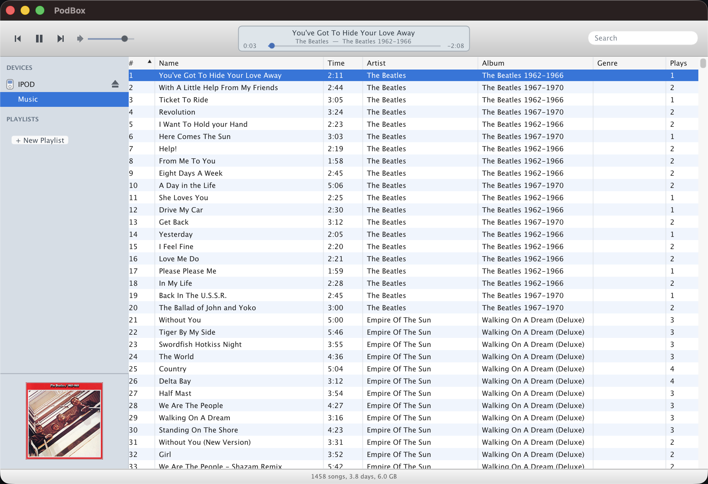

# PodBox

A standalone iPod manager for macOS — manage the music library on a classic
iPod the way the old iTunes and apps like PodCenter let you: **drag songs on,
delete songs off, build playlists — no full-library sync, no iTunes
required.** Built in C++ with [Dear ImGui](https://github.com/ocornut/imgui),
styled after iTunes 10.



## Features

### On the iPod

- **Browse** the iPod's library in a sortable, searchable track list, plus its
  playlists — in a faithful iTunes 10 look (Lucida Grande, source-list sidebar,
  toolbar with an "LCD" readout, capacity bar).
- **Narrow by genre, artist and album** with the column browser above the track
  list. Picking a genre narrows the artists and albums beside it, and the track
  list below; the search box narrows all three. Drag its bottom edge to resize.
- **Shuffle and repeat**, from the buttons at the bottom left, alongside a
  toggle for the Now Playing artwork well.
- **Add songs** by dragging files or folders onto the window. Metadata is read
  with TagLib and files are copied into the iPod's music folders with
  iTunes-style scrambled names. Copies run on a background thread with progress
  shown in the toolbar.
- **Delete songs** from the device (right-click → *Remove from iPod*, or select
  and press Delete), with a confirmation dialog.
- **Playlists** — create, rename, delete, add/remove tracks (right-click a song
  → *Add to Playlist*), and drag to reorder within a playlist.
- **Multi-select** with shift-click for ranges and ⌘-click to toggle. The
  context menu adapts: *Rate These Songs*, *Remove 12 Songs from iPod*.
- **Ratings** — five clickable stars in the track list, or right-click →
  *Rating*. Written straight into the database.
- **Get Info** (⌘I) to edit name, artist, album, genre, year and track number.
  Editing several songs at once prefills the fields they share and leaves blank
  ones alone, so you can retag an album's artist without touching its titles.
- **Play counts & ratings** written by the iPod are merged back into the
  library automatically on connect — and forward into your Mac library, where
  counts only ever increase.
- **Album artwork** embedded in your files is shown for the selected track.
- **Play songs from the iPod on your Mac** — double-click a track (or use the
  transport controls) to play it through your computer's speakers, with a
  now-playing display, seek scrubber, volume, and auto-advance.
- **Import in any format** — drop in MP3, AAC, ALAC, WAV, AIFF, or **FLAC**.
  Choose to keep files as-is, or convert everything to Apple Lossless (ALAC) or
  MP3 on import. FLAC is always converted so it plays on the iPod.
- **Safe eject** — click the eject button next to the device to flush and
  unmount before you unplug.

### On your Mac

- **A music library of your own.** Point PodBox at folders and it indexes them
  in place. It reads tags and computes a fingerprint; it **never moves, renames
  or modifies your files**. The index lives in
  `~/Library/Application Support/PodBox/library.tsv`.
- **Watch folders** — add and remove them under *Folders…* in the sidebar, with
  a per-folder enable switch and a live song count. Rescanning is incremental:
  files whose size and modification time are unchanged are skipped. Files that
  have disappeared are *flagged*, not deleted, and a folder on a drive that
  isn't mounted is treated as unavailable rather than empty.
- **Import from Apple Music** — PodBox reads your Music.app library through
  AppleScript and **copies** the files out to `~/Music/PodBox/Artist/Album/`.
  It never writes to Apple Music's own folder, which is protected by macOS and
  reorganised by Music.app behind your back. The copy is resumable: run it
  again after cancelling and it skips what's already there. Streaming-only
  entries, tracks whose file is missing, and DRM-protected `.m4p` files are
  reported and skipped — a classic iPod cannot play the last of those.
- **Sync to the iPod** — PodBox diffs the two libraries and **shows you the
  plan before writing anything**: how many songs and bytes would be copied,
  what's already there, what's missing. Removal is opt-in, off by default, and
  needs a second explicit confirmation; songs that exist only on the iPod are
  called out separately, because deleting those is not recoverable.
- **Find duplicates** — group the iPod's library by artist/title/album/length
  (*Exact*) or just artist and title (*Loose*), and remove the redundant
  copies in bulk. The better copy is kept: lossless first, then play count,
  rating, bitrate, file size. **Playlists are never shortened** — an entry
  pointing at a removed copy is rewritten to the one being kept. Optionally
  verify that copies are byte-for-byte identical before removing anything.

### Why re-tagging doesn't confuse it

Songs are matched on artist/title/album/duration *and* an audio fingerprint
that covers only the audio stream — ID3 tags, FLAC metadata blocks and the MP4
`moov` atom are excluded. Retagging a file therefore does not change its
identity. A fingerprint match means two files are certainly the same; a
mismatch means very little, since re-encoding changes every byte.

Because a transcoded copy can never byte-match what it came from, PodBox
records the *source* fingerprint at import time in a small sidecar on the
device (`iPod_Control/iTunes/PodBoxFingerprints`). Without it, a FLAC library
imported as ALAC would look entirely new on every sync and copy itself again
forever.

## Supported devices

PodBox reads the library of **any classic-line iPod** — 1st through 5.5th
generation, iPod mini, iPod photo, and iPod nano/classic — by parsing the
`iTunesDB` directly.

**Writing** (adding/removing songs and playlists) currently works on iPods
whose database needs no checksum: **iPod 1st–5.5th generation, iPod mini, iPod
photo, and iPod nano 1st/2nd generation.** PodBox reads the required hashing
scheme from the database header and refuses to write — rather than risk
corrupting the library — on models that need a checksum it does not yet
produce. On those devices PodBox is strictly read-only: the affected controls
are disabled and the device pane says why.

| Model | Read | Write |
|---|---|---|
| iPod 1st–5.5th gen, mini, photo, nano 1G/2G | ✅ | ✅ |
| iPod classic (6G/7G), nano 3G–5G | ✅ | ⛔ needs *hash58* (planned) |
| iPod nano 6G/7G | ✅ | ⛔ needs *hash72* |
| iPod shuffle | — | — separate `iTunesSD` format (planned) |
| iPod touch / iPhone | — | — different sync protocol, out of scope |

The iPod must be mounted as a disk. Windows-formatted (FAT32) iPods mount
automatically on macOS; a Mac-formatted (HFS+) iPod works too. If your iPod
only appears in Finder's device sync view, enable "disk use" once (or boot it
into disk mode with Select+Play) so it mounts as a volume.

## Coexisting with Apple Music

PodBox is careful to share an iPod with Music.app rather than take it over.

- A read/write cycle **preserves what PodBox does not model**: original track
  headers, unrecognised metadata records (sort keys, album artist, comments,
  artwork references), smart-playlist criteria, and whole datasets such as
  podcasts and the album list. On a real Music.app-written database this cuts
  what a write discards from 31% to 2.6%, and the declared database version is
  preserved rather than downgraded.
- PodBox **refuses to write while Music.app appears to be mid-sync**, detected
  from a database timestamp newer than its own. Two writers on one `iTunesDB`
  is the one thing that can genuinely corrupt it.

## Building

Requires **macOS 11 or newer**. Two ways to build:

### With Nix (reproducible)

```sh
nix build github:MilanMarocchi/podbox
open result/Applications/PodBox.app
```

The flake pins every dependency by commit hash and builds with no network
access, so the same input tree produces a bit-for-bit identical binary on any
machine. `nix run github:MilanMarocchi/podbox` launches it without installing;
`nix develop` drops you into a shell with the toolchain and the pinned sources
ready, so an in-shell `cmake -S . -B build && cmake --build build -j`
configures offline and builds exactly what `nix build` builds.

### With CMake

Requires **CMake 3.24+** and a **C++20** compiler — on macOS that's the Command
Line Tools (`xcode-select --install`). All dependencies — Dear ImGui, GLFW,
TagLib, stb — are fetched automatically by CMake at configure time; nothing
needs to be installed via Homebrew.

```sh
git clone https://github.com/MilanMarocchi/podbox.git
cd podbox
cmake -S . -B build
cmake --build build -j
open build/PodBox.app
```

Note the app is a **bundle**, not a bare binary: `PodBox.app` is what carries
the icon and the `Info.plist` usage strings, without which macOS will not let
PodBox ask Music.app for anything. To run it in a terminal and see its output,
use `./build/PodBox.app/Contents/MacOS/PodBox`.

Builds are **unsigned and un-notarised**, so the first launch needs a
right-click → *Open* to get past Gatekeeper. On first use macOS will also
prompt for permission to control Music.app and to read removable volumes and
your Downloads folder; these correspond to the usage strings in
`packaging/Info.plist.in`, and declining them disables the matching features.

Linux support is planned; the device-detection layer is already isolated behind
platform guards, but the audio backend is a stub there and transcoding, the
folder picker and the Apple Music import all shell out to macOS tools. The Nix
flake is macOS-only for that reason.

## Usage

1. Plug in your iPod and wait for it to mount. PodBox detects it and shows the
   model, serial, firmware and capacity under the **device** entry.
2. Click **Music** to see every song, or a **playlist** to see its contents.
   Sort by clicking a column header; filter with the search box.
3. **Add music**: drag audio files or folders onto the window. Accepted formats
   are MP3, AAC/ALAC (`.m4a`/`.m4b`), WAV, AIFF and FLAC. Pick an import format
   under the device view (*Keep original*, *ALAC*, or *MP3*); FLAC is always
   converted so it plays on the iPod.
4. **Play a song**: double-click it, or use the play/prev/next controls and
   volume in the toolbar. Drag the scrubber to seek.
5. **Remove music**: right-click a song → *Remove from iPod*.
6. **Playlists**: click *+ New Playlist*, or right-click a song → *Add to
   Playlist*. Right-click a playlist to rename or delete it. Drag rows to
   reorder a playlist.
7. **Build a Mac library**: under **Library** in the sidebar, use *Folders…* to
   add the folders your music lives in, then *Rescan*. Use *Apple Music…* to
   copy tracks out of Music.app. Then *Sync Library to iPod…* in the device
   pane.
8. **Eject** with the button on the device row before unplugging.

If you have never used PodBox before and one of `~/Soulseek Downloads/complete`,
`~/Soulseek Downloads` or `~/Nicotine Downloads` exists, the most specific of
them is added as a watch folder automatically. Remove it under *Folders…* if
that isn't what you want.

MP3 conversion uses `ffmpeg` or `lame` if installed; without either, the "MP3"
option falls back to AAC (which the iPod also plays) and relabels itself to say
so. ALAC conversion prefers `ffmpeg` and falls back to `afconvert`, which ships
with macOS. **ALAC output is always 16-bit and at most 48 kHz** — a classic
iPod accepts a 24-bit ALAC file and then silently refuses to play it.

## Safety

PodBox writes directly to your iPod's database, so it is careful:

- **Five rolling backups.** Before every write the current database is rotated
  into `iTunesDB.podbox-bak.1` … `.5`. The very first PodBox write additionally
  keeps the original iTunes-written database forever as
  `iTunesDB.podbox-backup`. Restore any of them from the device pane
  (*Restore Database…*), which lists each backup with its date and song count;
  restoring rotates the current state in first, so the restore is itself
  undoable.
- **Atomic writes.** Every database write goes to a temporary file and is then
  renamed into place, so an interrupted write cannot corrupt the library.
- **Writes are refused** on iPods that need a checksum PodBox cannot produce
  (see the table above), while Music.app is mid-sync, and when the device's
  `Play Counts` file cannot be matched to the track list — in that last case
  the file is preserved rather than deleted, because it still holds listening
  history that a later load may be able to merge.

Restoring a database does not delete any songs: it only replaces the index. A
song added since that backup was taken stays on the disk, just unlisted.

Back up anything you care about before using pre-release software on it.

## Files PodBox creates

On your Mac:

| Path | What |
|---|---|
| `~/Library/Application Support/PodBox/library.tsv` | the Mac library index and watch-folder list |
| `~/Music/PodBox/` | files copied out of Apple Music |

On the iPod, all under `iPod_Control/iTunes/`:

| Path | What |
|---|---|
| `iTunesDB.podbox-bak.1` … `.5` | rolling backups |
| `iTunesDB.podbox-backup` | the original iTunes-written database, kept once |
| `PodBoxFingerprints` | source fingerprints, so transcoded imports are recognised |
| `iTunesDB.podbox-tmp` | transient; only present during a write |

Deleting any of these is safe; PodBox recreates what it needs.

## Command-line tools

The build also produces small utilities used for testing. With Nix they are in
`result/bin`; with CMake, in `build/`.

| Tool | Usage |
|---|---|
| `itdb_dump` | `<iTunesDB> [<out> [+pl]]` — print a database summary. With an output path, round-trip it through the writer and verify nothing changed; `+pl` also injects a synthetic playlist first (needs ≥3 tracks). |
| `podbox_add` | `<mount-point> [--alac\|--mp3] <file>...` — add files to a mounted iPod from the shell, using the same pipeline as the GUI. |
| `playcounts_test` | `<iTunesDB> <Play Counts>` — verify the play-count merge. |
| `audio_test` | `<audiofile> [seconds]` — play a file through the audio backend (default 3 s). macOS only. |
| `library_test` | `[show\|scan\|add <dir>\|health\|dupes]` — exercise the Mac library; defaults to `show`. Touches only `~/Library/Application Support/PodBox/`. |
| `applemusic_test` | `[summary\|list <n>\|copy <n>\|copy all]` — defaults to `summary`, which reads everything and writes nothing. `copy` writes into `~/Music/PodBox`. |
| `sync_test` | `<ipod-mount> [--remove]` — print the sync plan. Entirely read-only; needs a saved Mac library. |
| `dedupe_test` | `[<music-dir> [verbose]]`, or `--fp <file>...` to print and compare fingerprints. The only tool with real assertions; exits non-zero on failure. |

`dedupe_test` is registered with CTest, so `ctest --test-dir build` runs it.

## How it works

See [docs/ARCHITECTURE.md](docs/ARCHITECTURE.md) for the module map, the
threading contract and the `iTunesDB` format notes.

In short: the `iTunesDB` is a binary tree of tagged records (`mhbd` → `mhsd` →
track and playlist lists). PodBox has its own reader and writer for this format
(`src/itdb/`) rather than depending on the venerable but hard-to-build
[libgpod](http://www.gtkpod.org/libgpod/). Songs live in
`iPod_Control/Music/F00…F49` under obfuscated names; the play counts, ratings
and on-the-go playlists the device records live in a separate `Play Counts`
file that is merged on connect.

## Roadmap

- `hash58` checksum so iPod classic and nano 3G–5G can be written
- Album artwork **on** the device (`ArtworkDB` + `.ithmb` thumbnails)
- Podcasts and audiobooks as first-class media types
- iPod shuffle (`iTunesSD`) support
- Code signing and notarisation, so Gatekeeper stops complaining
- Linux build (audio backend + device layer)

## License

[MIT](LICENSE) © 2026 Milan Marocchi. Contributions welcome.

This project is not affiliated with or endorsed by Apple. iPod and iTunes are
trademarks of Apple Inc.
